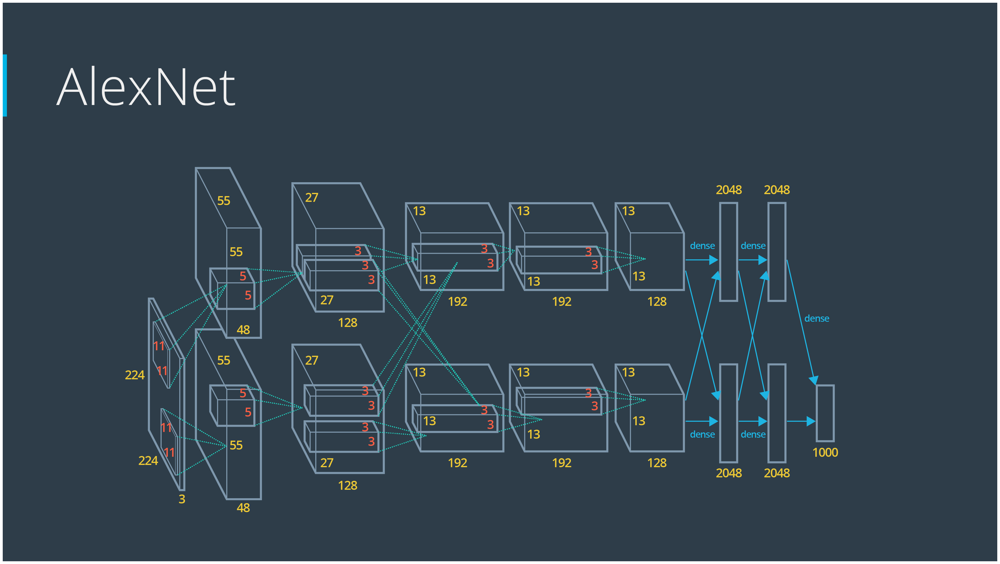

# AlexNet 

## Highlights
1. First usage of ReLu.
1. Usage of dropout for regularization.
1. 

## Network

1. Network was trained on 2 GPU. Hence has two parallel branches. The two branches communicate.

## Training

## Results

## Latest conclusions

